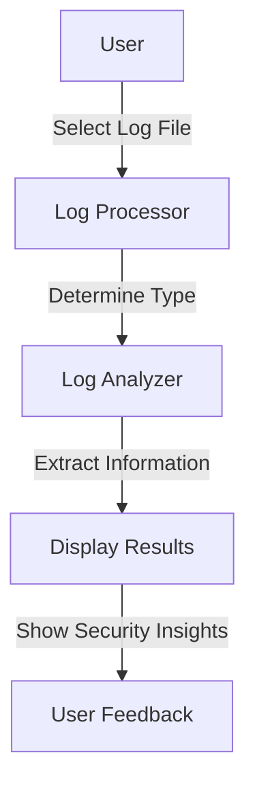

# Cybersecurity Monitoring Tool

   
*Protect, Monitor, Secure*

## Overview
The **Cybersecurity Monitoring Tool** is a Python-based application designed to process and analyze different types of system logs. The tool provides insights into authentication attempts, firewall activities, system warnings, network traffic, and web server access logs. It features a GUI interface for user-friendly log file selection and processing.

## Features
- 📂 **Multi-log type support**: Processes authentication logs, syslogs, firewall logs, network logs, and web server logs.
- 🔍 **Automated log type detection**: Determines the log type based on the content.
- 🖥️ **GUI Interface**: Uses Tkinter for an interactive experience.
- ⚠️ **Security Insights**: Extracts and displays failed login attempts, blocked IPs, system warnings, and network connections.
- 🖥️ **Cross-platform**: Runs on Windows (executable provided) and can be executed using Python.

## Supported Log Types
📌 **Authentication Logs (`auth.log`)**: Detects failed and successful login attempts.  
📌 **System Logs (`syslog.log`)**: Identifies errors, critical warnings, and system events.  
📌 **Firewall Logs (`firewall_log.txt`)**: Extracts blocked IP addresses.  
📌 **Network Logs (`network_log.txt`)**: Displays active network connections.  
📌 **Web Server Logs (`web_log.txt`)**: Captures web requests, including GET/POST operations.

## Installation & Execution
### Running the Python Script
#### Prerequisites:
- Python 3.x
- Required libraries: `tkinter`

#### Steps:
1. Install dependencies (if necessary):
   ```sh
   pip install tk
   ```
2. Run the script:
   ```sh
   python monitoringtool.py
   ```

## The code explained in details.

### 1. Importing Required Modules
   ```python
   import re  # Regular expressions for searching and extracting log data
   import tkinter as tk  # The core Tkinter module for GUI applications
   from tkinter import filedialog, scrolledtext, ttk, messagebox  # Additional Tkinter components
   from collections import defaultdict  # Dictionary that provides default values when keys don't exist
   ```

#### Explanation:
📌 **re:** This module provides tools for pattern matching (searching for specific text patterns).  
📌 **tkinter:** Python’s built-in module for creating GUI applications.  
📌 **filedialog:** Allows users to select log files from their system.  
📌 **scrolledtext:** A text box that supports scrolling (useful for large log files).  
📌 **ttk:** A themed widget set that makes the GUI look modern.  
📌 **messagebox:** Used to show pop-up messages (errors, alerts, etc.).  
📌 **defaultdict:** Similar to a dictionary but initializes default values when keys are missing.  

### 2. Creating a Base Log Processor
Why do we need this?  
Instead of writing separate functions for each log type, we create a base class that contains common functionality like reading a file. Other specific log processors (Auth, Firewall, etc.) will inherit from this base class.

```python
class LogProcessor:
    def __init__(self, file_path):
        """ 
        Initializes the log processor with the file path and a dictionary to store results.
        """
        self.file_path = file_path  # Store the file location
        self.data = defaultdict(list)  # Dictionary where each key will store a list of logs
    
    def read_log(self):
        """ 
        Reads the entire log file and returns a list of lines.
        If the file is not found, it returns an empty list.
        """
        try:
            with open(self.file_path, 'r') as file:
                return file.readlines()  # Read all lines into a list
        except FileNotFoundError:
            return []  # If file is missing, return an empty list
    
    def process(self):
        """ 
        This method will be **overridden** by subclasses to process specific log types.
        """
        raise NotImplementedError("Subclasses must implement this method")
```
#### Explanation:
📌 **self.file_path:** Stores the path of the log file.  
📌 **self.data:** Uses defaultdict(list) to store categorized log data.  
📌 **read_log():** Reads the file and returns a list of log lines.  
📌 **process():** This method must be overridden in subclasses. It raises an error if not implemented.  

### 3. Creating Specific Log Processors
Now, let's define different log processors that inherit from LogProcessor. Each subclass analyzes a specific type of log.

   #### 1. Processing Authentication Logs (auth.log)
   ```python
   class AuthLogProcessor(LogProcessor):
      def process(self):
         """ 
         Extracts failed and successful login attempts from authentication logs.
         """
         self.data.clear()  # Clear any previous log data

         for line in self.read_log():  # Read each line from the log file
               if "Failed password" in line:  # Check for failed login attempts
                  match = re.search(r'Failed password for (.+?) from (\d+\.\d+\.\d+\.\d+)', line)
                  if match:
                     self.data['Failed Attempts'].append((match.group(1), match.group(2)))  # Store username & IP
               
               elif "Accepted password" in line:  # Check for successful logins
                  match = re.search(r'Accepted password for (\w+) from (\d+\.\d+\.\d+\.\d+)', line)
                  if match:
                     self.data['Successful Logins'].append((match.group(1), match.group(2)))  # Store username & IP
         
         return self.data  # Return the processed log data
   ```
   ##### Explanation:
   - Searches for "Failed password" and "Accepted password".  
   - Extracts the username and IP address.  
   - Stores them under Failed Attempts and Successful Logins.  


   #### 2. Processing System Logs (syslog)
   ```python
   class SysLogProcessor(LogProcessor):
      def process(self):
         """ 
         Extracts important system warnings and errors.
         """
         self.data.clear()
         error_keywords = ["failed", "error", "critical", "warning", "disk usage", "memory usage", "stopped"]
         
         for line in self.read_log():
               normalized_line = line.strip().lower()  # Normalize text for easier keyword matching
               if any(keyword in normalized_line for keyword in error_keywords):  # Check for error keywords
                  self.data['System Alerts'].append(line.strip())  # Store relevant log lines
         
         return self.data  # Return the processed log data
   ```
   ##### Explantion:
   - Looks for error messages in system logs.    
   - Normalizes the text (converts to lowercase).    
   - If a line contains keywords like "error" or "failed", it stores it under System Alerts.    

   #### 3. Processing Firewall Logs (firewall.log)
   ```python
   class FirewallLogProcessor(LogProcessor):
      def process(self):
         """ 
         Identifies blocked IPs from firewall logs.
         """
         self.data.clear()
         
         for line in self.read_log():
               if "UFW BLOCK" in line:  # Look for firewall block events
                  match = re.search(r'SRC=(\d+\.\d+\.\d+\.\d+)', line)
                  if match:
                     self.data['Blocked IPs'].append(match.group(1))  # Store blocked IP
         
         return self.data
   ```
   ##### Explanation:
   - Looks for "UFW BLOCK" entries.  
   - Extracts and stores IP addresses that were blocked.  

   #### 4. Processing Web Server Logs (access.log)
   ```python
   class WebServerLogProcessor(LogProcessor):
      def process(self):
         """ 
         Extracts web server access attempts.
         """
         self.data.clear()
         
         for line in self.read_log():
               match = re.search(r'(\d+\.\d+\.\d+\.\d+) - - \[.+\] \"(GET|POST) (.+?)\"', line)
               if match:
                  self.data['Access Attempts'].append((match.group(1), match.group(2), match.group(3)))  # Store IP, method, URL
         
         return self.data
   ```
   ##### Explanation:
   Extracts:  
   - IP address of the user.  
   - Request type (GET/POST).  
   - Page accessed.  

   #### 5. Processing Network Logs
   ```python
   class NetworkLogProcessor(LogProcessor):
      def process(self):
         """ 
         Extracts network connection details.
         """
         self.data.clear()
         
         for line in self.read_log():
               match = re.search(r'SRC=(\d+\.\d+\.\d+\.\d+) DST=(\d+\.\d+\.\d+\.\d+) PROTO=(TCP|UDP) DPT=(\d+)', line)
               if match:
                  self.data['Network Connections'].append((match.group(1), match.group(2), match.group(3), match.group(4)))  # Store Source IP, Destination IP, Protocol, Port
         
         return self.data
   ```
   ##### Explanation:
   Extracts:  
   - Source IP address.  
   - Destination IP address.  
   - Protocol (TCP/UDP).  
   - Port Number.  

### 4. Creating the Log Analyzer GUI (LogGUI)
The GUI is built using Tkinter, which provides buttons, dropdown menus, and a text area for displaying results.

   #### 1. Initializing the GUI
   ```python
   class LogGUI:
      def __init__(self, root):
         """ 
         Initializes the GUI window, widgets, and layout.
         """
         self.root = root  # Store the root Tkinter window
         self.root.title("Log Processor GUI")  # Set the window title
         self.root.geometry("600x400")  # Set the window size
         self.root.configure(bg="#f0f0f0")  # Set the background color
         
         # Dictionary mapping log types to their respective processors
         self.log_types = {
               "auth": AuthLogProcessor,
               "syslog": SysLogProcessor,
               "firewall": FirewallLogProcessor,
               "web": WebServerLogProcessor,
               "network": NetworkLogProcessor
         }
         
         self.file_path = None  # Store the path of the selected log file

         # Create a frame to hold widgets (better for layout management)
         self.frame = ttk.Frame(root, padding=10)
         self.frame.pack(fill=tk.BOTH, expand=True)  # Expand to fill the window
         
         # Label for selecting log type
         ttk.Label(self.frame, text="Select Log Type:", font=("Arial", 12)).pack(pady=5)
         
         # Dropdown menu to choose log type
         self.log_type_var = tk.StringVar(value="auth")  # Default to "auth" logs
         self.dropdown = ttk.Combobox(self.frame, textvariable=self.log_type_var, values=list(self.log_types.keys()))
         self.dropdown.pack(pady=5)
         
         # Button to browse log file
         self.file_button = ttk.Button(self.frame, text="Browse Log File", command=self.browse_file)
         self.file_button.pack(pady=5)
         
         # Button to process log file
         self.process_button = ttk.Button(self.frame, text="Process Log", command=self.process_log)
         self.process_button.pack(pady=5)
         
         # Scrollable text area to display results
         self.text_area = scrolledtext.ScrolledText(self.frame, height=15, width=70, wrap=tk.WORD, font=("Courier", 10))
         self.text_area.pack(pady=5, padx=5)
   ```
   ##### Key Features:
   📌 **Dropdown Menu (Combobox):** Allows users to select the log type.  
   📌 **File Selection Button (Browse Log File):** Opens a file dialog to select a log file.  
   📌 **Process Button (Process Log):** Processes the selected log file.  
   📌 **Scrollable Text Area (ScrolledText):** Displays the processed log data.  

   #### 2. File Selection (browse_file)
   ```python
   def browse_file(self):
      """ 
      Opens a file dialog for the user to select a log file.
      Automatically processes the file if selected.
      """
      file_path = filedialog.askopenfilename()  # Open file selection dialog
      if file_path:
         self.file_path = file_path  # Store the selected file path
         self.process_log()  # Automatically process the file
   ```
   ##### What it does:
   - Opens a file dialog (askopenfilename).  
   - Stores the file path (self.file_path).  
   - Calls process_log() automatically after selection.  

   #### 3. Processing the Log File (process_log)
   This is the core logic that determines the log type and processes the data.
   ```python
   def process_log(self):
      """ 
      Processes the selected log file, determines its type, and displays the results.
      """
      if not self.file_path:
         messagebox.showerror("Error", "No file selected.")  # Show error if no file is chosen
         return

      selected_log_type = self.log_type_var.get()  # Get the user-selected log type

      # Read the first few lines to determine log type
      with open(self.file_path, 'r') as file:
         first_lines = [file.readline().lower() for _ in range(5)]  # Read the first 5 lines

      # Keywords for detecting log types
      auth_keywords = ["failed password", "accepted password"]
      syslog_keywords = ["error", "failed", "systemd", "auditd"]
      firewall_keywords = ["firewalld", "iptables", "ufw", "ufw block"]
      web_keywords = ["nginx", "apache", "http/1.1", "403 forbidden", "404 not found", "get", "post"]
      network_keywords = ["dhcp", "arp", "icmp", "tcpdump", "src=", "dst=", "proto=", "dpt="]

      # Counting keyword occurrences
      auth_count = sum(1 for line in first_lines if any(keyword in line for keyword in auth_keywords))
      syslog_count = sum(1 for line in first_lines if any(keyword in line for keyword in syslog_keywords))

      # Automatic log type detection based on keywords
      if auth_count > 0 and syslog_count == 0:
         detected_log_type = "auth"  # Authentication logs
      elif syslog_count > 0:
         detected_log_type = "syslog"  # System logs
      elif any(keyword in line for keyword in firewall_keywords for line in first_lines):
         detected_log_type = "firewall"  # Firewall logs
      elif any(keyword in line for keyword in web_keywords for line in first_lines):
         detected_log_type = "web"  # Web server logs
      elif any(keyword in line for keyword in network_keywords for line in first_lines):
         detected_log_type = "network"  # Network logs
      elif any(re.search(r'SRC=\d+\.\d+\.\d+\.\d+ DST=\d+\.\d+\.\d+\.\d+', line) for line in first_lines):
         detected_log_type = "network"  # Network logs (alternative detection)
      else:
         messagebox.showerror("Error", "Could not determine the log type. Please select the correct type manually.")
         return

      # If the detected log type differs from the selected log type, notify the user
      if detected_log_type != selected_log_type:
         messagebox.showinfo("Log Type Changed", 
                              f"Selected log type '{selected_log_type}' does not match the file contents.\n"
                              f"Automatically switching to '{detected_log_type}'.")

      self.log_type_var.set(detected_log_type)  # Update the dropdown selection

      try:
         self.text_area.delete(1.0, tk.END)  # Clear the text area
         processor = self.log_types[detected_log_type](self.file_path)  # Initialize the correct processor
         analyzer = LogAnalyzer(processor)  # Create a LogAnalyzer instance
         results = analyzer.analyze()  # Process the log file

         if not results:
               raise ValueError("No relevant log entries found.")  # If no data, show an error

         self.display_results(results)  # Display the results

      except Exception as e:
         messagebox.showerror("Error", f"Failed to process log: {str(e)}")  # Show an error if processing fails
   ```
   ##### What it does:
   - Reads the first 5 lines of the file to automatically detect the log type.  
   - Uses keyword matching to decide which log type it belongs to.  
   - If the detected log type is different from the user's selection, it automatically switches.  
   - Passes the file to the correct log processor and displays the results.  
   - Handles exceptions and shows error messages to the user.  

   #### 4. Displaying Processed Results (display_results)
   ```python
   def display_results(self, results):
      """ 
      Displays the processed log data in the text area.
      """
      self.text_area.delete(1.0, tk.END)  # Clear the text area
      
      for key, values in results.items():  # Iterate over the result categories
         self.text_area.insert(tk.END, f"{key}:\n")  # Insert category name
         for value in values:
               self.text_area.insert(tk.END, f"  {value}\n")  # Insert log details
   ```
   ##### What it does:
   - Clears the text box.  
   - Formats the results into readable sections.  
   - Displays categorized log data.  

### 5. Running the GUI
```python
if __name__ == "__main__":
    root = tk.Tk()  # Create the main window
    app = LogGUI(root)  # Initialize the LogGUI class
    root.mainloop()  # Run the Tkinter event loop
```
This starts the GUI application.

## Running the Executable (Windows)
1. Locate `monitoring_tool.exe` in the `dist` folder.
2. Double-click to launch the application.

## Usage
1. 🏁 Open the application.
2. 🔽 Select a log type or allow auto-detection.
3. 📂 Browse and select a log file.
4. 🚀 Click "Process Log" to analyze the file.
5. 📊 View results in the display area.

## Diagram


## License
This project is licensed under the **MIT License**. See the `LICENSE` file for details.

## Author
Developed as part of a cybersecurity assignment due on **March 28, 2025**. 🚀


