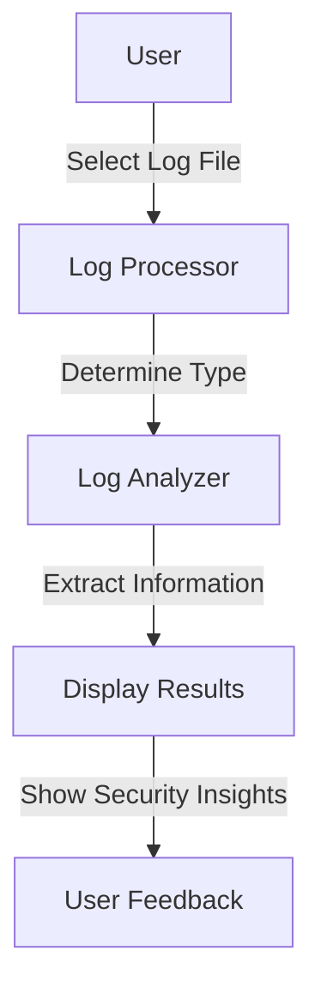

# Cybersecurity Monitoring Tool

  
*Protect, Monitor, Secure*

## Overview
The **Cybersecurity Monitoring Tool** is a Python-based application designed to process and analyze different types of system logs. The tool provides insights into authentication attempts, firewall activities, system warnings, network traffic, and web server access logs. It features a GUI interface for user-friendly log file selection and processing.

## Features
- 📂 **Multi-log type support**: Processes authentication logs, syslogs, firewall logs, network logs, and web server logs.
- 🔍 **Automated log type detection**: Determines the log type based on the content.
- 🖥️ **GUI Interface**: Uses Tkinter for an interactive experience.
- ⚠️ **Security Insights**: Extracts and displays failed login attempts, blocked IPs, system warnings, and network connections.
- 🖥️ **Cross-platform**: Runs on Windows (executable provided) and can be executed using Python.

## Supported Log Types
📌 **Authentication Logs (`auth.log`)**: Detects failed and successful login attempts.  
📌 **System Logs (`syslog.log`)**: Identifies errors, critical warnings, and system events.  
📌 **Firewall Logs (`firewall_log.txt`)**: Extracts blocked IP addresses.  
📌 **Network Logs (`network_log.txt`)**: Displays active network connections.  
📌 **Web Server Logs (`web_log.txt`)**: Captures web requests, including GET/POST operations.

## Installation & Execution
### Running the Python Script
#### Prerequisites:
- Python 3.x
- Required libraries: `tkinter`

#### Steps:
1. Install dependencies (if necessary):
   ```sh
   pip install tk
   ```
2. Run the script:
   ```sh
   python monitoringtool.py
   ```

### Running the Executable (Windows)
1. Locate `monitoring_tool.exe` in the `dist` folder.
2. Double-click to launch the application.

## Usage
1. 🏁 Open the application.
2. 🔽 Select a log type or allow auto-detection.
3. 📂 Browse and select a log file.
4. 🚀 Click "Process Log" to analyze the file.
5. 📊 View results in the display area.

## Diagram


## License
This project is licensed under the **MIT License**. See the `LICENSE` file for details.

## Author
Developed as part of a cybersecurity assignment due on **March 28, 2025**. 🚀


